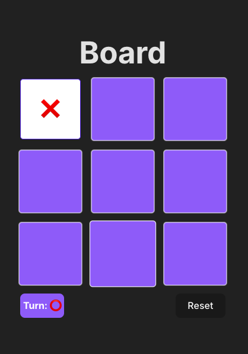

# Animated Tic Tac Toe Game

A simple yet entertaining Tic Tac Toe game built with React and TypeScript. The game features sleek animations to enhance user experience, making each move on the board visually engaging.

## Preview



## Features

- **Interactive Gameplay:** Easy to play with a clean and intuitive interface.
- **Smooth Animations:** Transition animations for a visually pleasing experience.
- **Reset Game:** Easily reset the game with a single click to start fresh.
- **Built with TypeScript:** Strong typing ensures code quality and understandability.

## Technologies

- React
- TypeScript
- Framer Motion for animations

## Installation

1. Clone the repository:

```bash
git clone https://github.com/freidev/tic-tac-toe.git
cd tic-tac-toe
npm install
# or
yarn install
```

Now, open http://localhost:5173 in your browser to play the game!

## Usage

Click on any square to make a move.
The game will automatically determine the winner or if it's a draw.
Click the "Reset" button to start a new game.

## Contribution

Feel free to fork the project, open issues, and submit pull requests.
